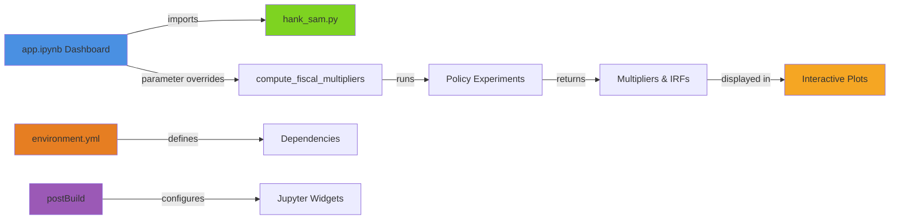

# HANK-SAM Model Interactive Dashboard

This interactive dashboard allows you to explore the HANK-SAM model's fiscal multipliers under different monetary and fiscal policy parameters.

## Features

- **Real-time parameter adjustment**: Modify model parameters and see results update automatically
- **Multiple policy regimes**: Compare standard Taylor rule, fixed nominal rate, and fixed real rate monetary policies
- **Three fiscal policies**: Analyze UI extensions, stimulus checks (transfers), and tax cuts
- **Visual outputs**: 
  - Fiscal multipliers over 20 quarters
  - Consumption impulse responses
  - Parameter summary display
- **🚀 Auto-deployment**: GitHub Actions with MyBinder integration for seamless sharing

## Files Overview

- **`app.ipynb`**: Main Jupyter notebook dashboard (primary file for Voila)
- **`app.py`**: Python script version (jupytext sync with notebook)
- **`hank_sam.py`**: Core HANK-SAM model implementation
- **`environment.yml`**: Canonical conda environment with all dependencies
- **`postBuild`**: MyBinder setup script for widget configuration

## Requirements

- **Python**: 3.11+ (specified in environment.yml)
- **Environment**: All dependencies managed via `environment.yml`
- **Jupyter widgets**: Pre-configured for Voila compatibility

## Installation & Setup

### Method 1: Using Conda/Micromamba (Recommended)

```bash
# Create environment from dashboard directory
conda env create -f environment.yml
conda activate hafiscal-dashboard

# Enable Jupyter widgets
jupyter nbextension enable --py widgetsnbextension --sys-prefix
```

### Method 2: Using Existing Environment

If you have the main project environment:

```bash
# Activate your existing environment
conda activate hafiscal  # or your environment name

# Install additional dashboard dependencies
pip install voila ipywidgets nbconvert
jupyter nbextension enable --py widgetsnbextension --sys-prefix
```

## Running the Dashboard

### Method 1: Voila (Recommended for Production)

```bash
# Run from project root directory (important!)
voila dashboard/app.ipynb --no-browser
```

Then open your browser to the URL shown (typically http://localhost:8866).

### Method 2: Jupyter Notebook (Development)

```bash
# Run from project root directory
jupyter notebook dashboard/app.ipynb
```

Run all cells to see the interactive dashboard in notebook mode.

### Method 3: MyBinder (No Installation Required)

Launch directly in your browser via MyBinder:
[](https://mybinder.org/v2/gh/llorracc/HAFiscal-Latest/master?urlpath=voila%2Frender%2Fapp.ipynb)

*Note: MyBinder may take 2-3 minutes to build the environment on first launch.*

## Deployment

### GitHub Actions Integration

The dashboard auto-deploys when changes are pushed to relevant branches:

- **Main/Master branches**: Deploy to GitHub Pages with MyBinder backend
- **Pull Requests**: Create preview artifacts with direct MyBinder links
- **Manual trigger**: Workflow can be run manually via GitHub Actions tab

### Files for Deployment

- **`environment.yml`**: Single source of truth for both CI and MyBinder
- **`postBuild`**: Ensures consistent widget setup across environments
- **`.github/workflows/deploy-dashboard.yml`**: Complete CI/CD pipeline

## Tunable Parameters

### Monetary Policy
- **Taylor Rule π coefficient (φπ)**: Central bank's response to inflation (1.0-3.0)
- **Taylor Rule Y coefficient (φy)**: Central bank's response to output gap (0.0-1.0)
- **Taylor Rule inertia (ρr)**: Interest rate smoothing parameter (0.0-0.95)
- **Phillips curve slope (κp)**: Price flexibility parameter (0.01-0.2)

### Fiscal & Structural
- **Fiscal adjustment speed (φb)**: How quickly taxes adjust to debt (0.0-0.1)
- **Real wage rigidity**: Degree of wage stickiness (0.0-1.0)

### Policy Durations
- **UI extension length**: Duration of unemployment insurance extension (1-12 quarters)
- **Stimulus check length**: Duration of transfer payments (1-4 quarters)
- **Tax cut length**: Duration of tax reduction (1-16 quarters)

## Understanding the Output

### Fiscal Multipliers Plot
Shows the cumulative fiscal multiplier (output per dollar of fiscal spending) over time for each policy under different monetary regimes:
- **Solid lines**: Standard Taylor rule
- **Dashed lines**: Fixed nominal interest rate
- **Dotted lines**: Fixed real interest rate

### Consumption Response Plot
Shows percentage deviation of consumption from steady state in response to each fiscal policy.

### Key Insights
- **UI extensions** typically have the highest multipliers due to targeting liquidity-constrained households
- **Fixed nominal/real rates** amplify fiscal policy effects compared to active Taylor rule
- **Tax cuts** generally have lower multipliers due to savings leakage among higher-income households

## Performance Notes

- **Simulation time**: 15-30 seconds per run (normal for HANK models)
- **Memory usage**: ~2-4GB RAM recommended for smooth operation
- **Browser compatibility**: Works best in Chrome/Firefox with JavaScript enabled

## Architecture



## Development Workflow

1. **Local development**: Edit `app.ipynb` or `app.py` (automatically synced)
2. **Test locally**: Run via Voila or Jupyter notebook
3. **Environment changes**: Update `environment.yml` (single source of truth)
4. **Deploy**: Push to GitHub → Actions auto-deploy to Pages + MyBinder
5. **Share**: Use MyBinder links from PR comments or deployment summary

## Troubleshooting

### Common Issues

1. **Import errors**: 
   - Ensure you're in the `dashboard/` directory
   - Check that environment is properly activated
   - Verify `hank_sam.py` is in the same directory

2. **Slow simulation updates**: 
   - Normal behavior - HANK models are computationally intensive
   - Consider closing other applications to free up memory

3. **Widget display issues**:
   - Run: `jupyter nbextension enable --py widgetsnbextension --sys-prefix`
   - Restart Jupyter/Voila after enabling extensions

4. **MyBinder timeouts**:
   - First launch takes 2-3 minutes to build environment
   - Subsequent launches from same GitHub commit are faster

### Environment Issues

If dependencies are missing or outdated:

```bash
# Recreate environment from scratch
conda env remove -n hafiscal-dashboard
conda env create -f environment.yml
conda activate hafiscal-dashboard
```

## Testing

Run the test suite to verify dashboard functionality:

```bash
# Run tests from project root directory
pytest dashboard/test_app.py dashboard/test_hank_sam.py -v
```

## Citation

If you use this dashboard in your research, please cite the original HAFiscal paper and acknowledge the dashboard implementation.

---

**Authors**: Alan Lujan <alujan@jhu.edu>  
**License**: Same as main HAFiscal project  
**Last Updated**: July 2025 